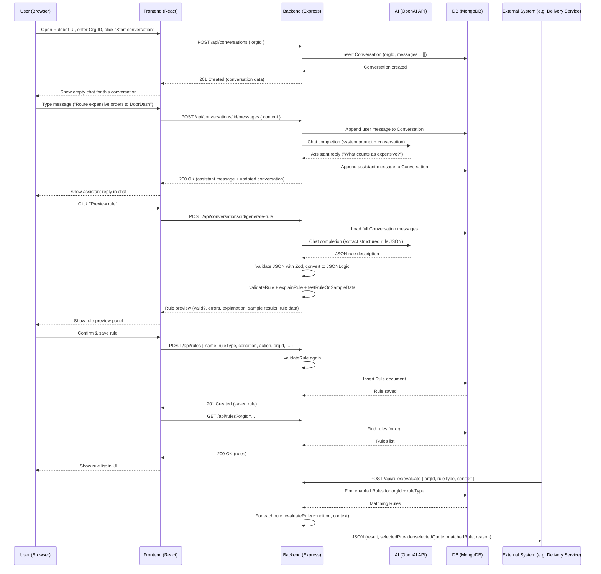

## App Flow – Sequence Diagram

This diagram shows, step by step, how a typical “design a rule and use it” journey works.

---

## App Flow – Explained Like You’re 10

Imagine you run a delivery company. You want simple “rules” like:

- “If the order is big, use DoorDash.”
- “If it’s small, use Uber.”

But you don’t want to write code. You just want to **talk**.

### 1. Talking to Rulebot

1. You open a web page.
2. You type which **company** (organization) you’re working on.
3. You click **Start conversation**.
4. Now you see a chat box with a helper called **Rulebot**.

You type:

> “Route expensive orders to DoorDash.”

Rulebot might say:

> “What dollar amount counts as expensive?”

You answer:

> “More than $150.”

Rulebot might ask:

> “And what should we do with cheaper orders?”

You answer:

> “Send them to Uber.”

So you just have a normal back-and-forth conversation, like texting a friend.

### 2. Turning the conversation into a real rule

When you click **Preview rule**, the app:

1. Reads your whole conversation with Rulebot.
2. Asks an AI model to write down the rule in a very **precise, machine-readable way**.
3. Checks that the rule only uses fields that actually exist (like `order.order_value`).
4. Tries that rule on a few **fake example orders**, like:
   - Order A: $200
   - Order B: $50
5. For each fake order, it sees what the rule would do:
   - Order A → DoorDash
   - Order B → Uber

Then it shows you:

- A **short name** for the rule (e.g. “Expensive orders to DoorDash”).
- A simple **explanation** (“If order value > $150, pick DoorDash, otherwise Uber.”).
- A few **sample results** so you can sanity-check it.

### 3. Saving the rule

If everything looks good, you click **Save**.

Now the rule is:

- Stored in a database,
- Tied to your organization,
- Marked as “ready to use.”

Think of it like saving a filter in your email app: from now on, that rule exists and can be used automatically.

### 4. Using the rule in real life

Later, when a real order comes in, another system (your delivery app) can ask:

> “Hey rules engine, for this order, who should deliver it?”

It sends:

- Which organization this order is for,
- What type of rule it wants (like “provider selection”),
- Details about the order (price, address, quotes, etc.).

The rules engine:

1. Looks up all the saved rules for that organization.
2. Tries each rule, one by one, on the order.
3. As soon as one rule says “Yes, I match this order,” it:
   - Returns who to pick (e.g. **DoorDash**),
   - And explains **why** in plain language.

So your delivery app doesn’t have to know any of the complicated logic.  
It just asks, “What should I do?” and gets back a clear answer and explanation.

